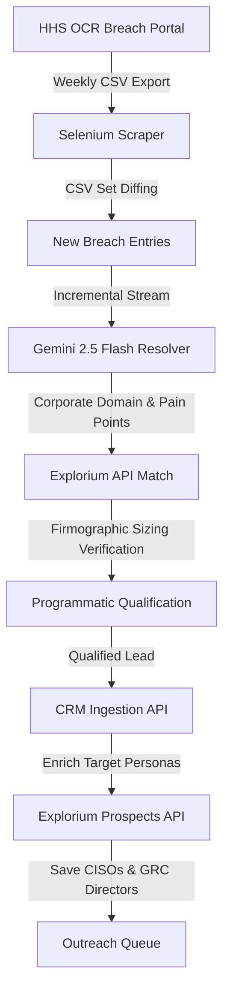

# Automated Lead Generation & Firmographic Enrichment Engine

This repository showcases an automated data engineering and AI-driven enrichment pipeline designed to monitor public regulatory databases, qualify prospects based on strict Ideal Customer Profile (ICP) criteria, and resolve target buyer contacts for B2B outreach.

## Pipeline Architecture

### 1. Scraper & Normalization Engine (`scrape_hhs.py`)
* Automated Selenium browser coordinator that navigates the JSF-based HHS OCR Portal to retrieve weekly HIPAA data breaches.
* Performs composite-key set diffing against baseline records to extract newly reported entries.
* Standardizes dynamically generated JSF viewstate headers into structured schemas.

### 2. Resolution & Pain Synthesis (`process_leads.py`)
* **Domain Resolution:** Uses Gemini 2.5 Flash to map covered healthcare entities (e.g., local medical systems) to their official corporate web domains.
* **Pain Points Formulation:** Drafts customized, context-aware cybersecurity pain narratives emphasizing SaaS security, HIPAA compliance, and vendor risk management tailored to the location and scale of the data compromise.

### 3. Sizing Verification & Lead Ingestion
* Programmatically checks the target's employee count and industry classification via **Explorium**.
* Filters leads programmatically against strict B2B ICP thresholds:
  * **Mid-Market Sweet Spot (100 - 5,000 employees):** Flagged as high-value, highly qualified targets.
  * **Enterprise (> 5,000 employees):** Categorized for strategic account targeting.
  * **SMB (< 100 employees):** Disqualified automatically.
* Posts qualified prospects to the outreach CRM endpoint in real-time.

### 4. Dynamic Contact Acquisition
* Resolves key security decision-maker profiles (e.g., Chief Information Security Officers, Directors of GRC) using the Explorium Prospects directory.
* Automatically synthesizes professional email networks and LinkedIn profiles to register contact records inside the outreach database.

---

*Note: This repository is a code showcase of automated outbound sales flows and is configured for demonstration purposes. Running the pipeline requires proprietary integration keys and internal database schemas.*
